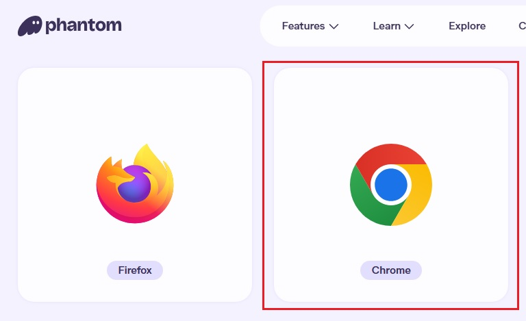
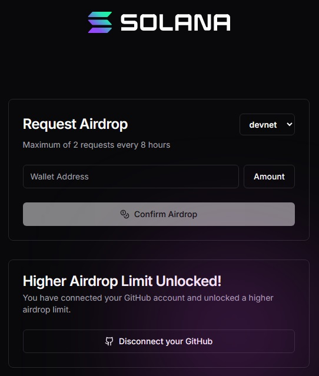
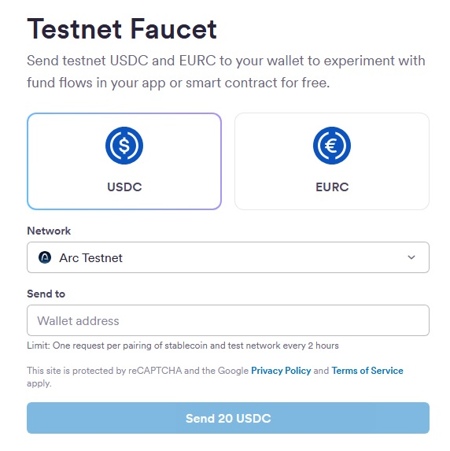
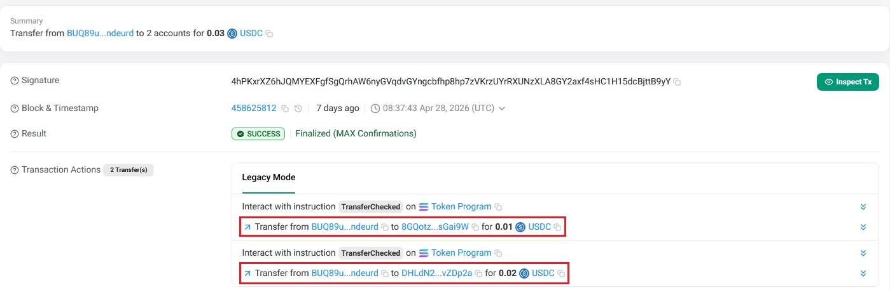

# Solana USDC Payment Transfer

A Next.js API endpoint for sending USDC (Solana SPL Token) to multiple recipients in a single transaction.

## Prerequisites

### Node.js
- Node.js 18+

### Solana Wallet Setup
1. Install [Phantom](https://phantom.com/download) browser extension

   
2. Create a new wallet or import existing
3. Request [SOL airdrop](https://faucet.solana.com/) for your network (Devnet/Testnet/Mainnet)

   
4. Request [USDC airdrop](https://faucet.circle.com/) if needed for testing

   

## Environment Setup

1. Copy `.env.example` to `.env`:

```bash
cp .env.example .env
```

2. Edit `.env` and set your Solana wallet credentials:

```env
PLATFORM_WALLET_ADDRESS=YOUR_WALLET_PUBLIC_KEY
PLATFORM_PRIVATE_KEY=YOUR_WALLET_PRIVATE_KEY_BASE58
```

## API Endpoint

### Send USDC to Multiple Recipients

**Endpoint:** `POST /api/send-usdc`

**Request Body:**
```json
{
  "recipients": [
    {
      "address": "8GQotzm8htPeAior8y8dXr7jRVzuhYx26ZCFhxsGai9W",
      "amount": 0.03
    },
    {
      "address": "DHLdN26BKuNqBN3SCYVNBdGJ1mm8WJb97bnRdBvZDp2a",
      "amount": 0.04
    }
  ]
}
```

**Response (Success):**


```json
{
  "success": true,
  "message": "USDC sent to multiple wallets successfully",
  "signature": "2H68iGazcuezZfvGqSyj1zg2KyxR6rqdTEiD6RBKkgzv1dKW2dDeDFXfrs4SFEQdFi5XNyfBYbn4qYEkud1UwUPf",
  "recipientsSent": 2
}
```

**Response (Error):**
```json
{
  "error": "Failed to send USDC",
  "details": "Error message describing what went wrong"
}
```

## Usage Example

```bash
curl -X POST http://localhost:3000/api/send-usdc \
  -H "Content-Type: application/json" \
  -d '{
    "recipients": [
      {"address": "8GQotzm8htPeAior8y8dXr7jRVzuhYx26ZCFhxsGai9W", "amount": 0.03},
      {"address": "DHLdN26BKuNqBN3SCYVNBdGJ1mm8WJb97bnRdBvZDp2a", "amount": 0.04}
    ]
  }'
```

## Transaction Explorer

View your transaction on Solana Explorer:

- [Devnet Explorer](https://explorer.solana.com/?cluster=devnet)
- [Testnet Explorer](https://explorer.solana.com/?cluster=testnet)
- [Mainnet Explorer](https://explorer.solana.com/)

Paste the transaction signature to view details.

## Configuration

| Environment Variable | Description | Default |
|---------------------|-------------|---------|
| `SOLANA_RPC_URL` | Solana RPC endpoint URL | `https://api.devnet.solana.com` |
| `SOLANA_USDC_MINT` | USDC token mint address | `4zMMC9srt5Ri5X14GAgXhaHii3GnPAEERYPJgZJDncDU` (Devnet) |
| `PLATFORM_WALLET_ADDRESS` | Your wallet's public key | (required) |
| `PLATFORM_PRIVATE_KEY` | Your wallet's private key (base58) | (required) |

## USDC Mint Addresses by Network

| Network | USDC Mint |
|---------|-----------|
| Devnet | `4zMMC9srt5Ri5X14GAgXhaHii3GnPAEERYPJgZJDncDU` |
| Testnet | `8zGuJQhw3H6NVmJ7kBbVZjxM5Z3w44Y5h4FbZ4x3` |
| Mainnet | `EPjFWdd5AufqSSqeM2qN1xzybapC8G4wEGGkZwyTDt1v` |

## Error Handling

The API returns appropriate HTTP status codes:

- `200` - Success
- `400` - Invalid request (missing recipients, invalid addresses, insufficient balance)
- `500` - Server error (RPC connection issues, transaction failure)
- `503` - Service unavailable (RPC connection failed)
